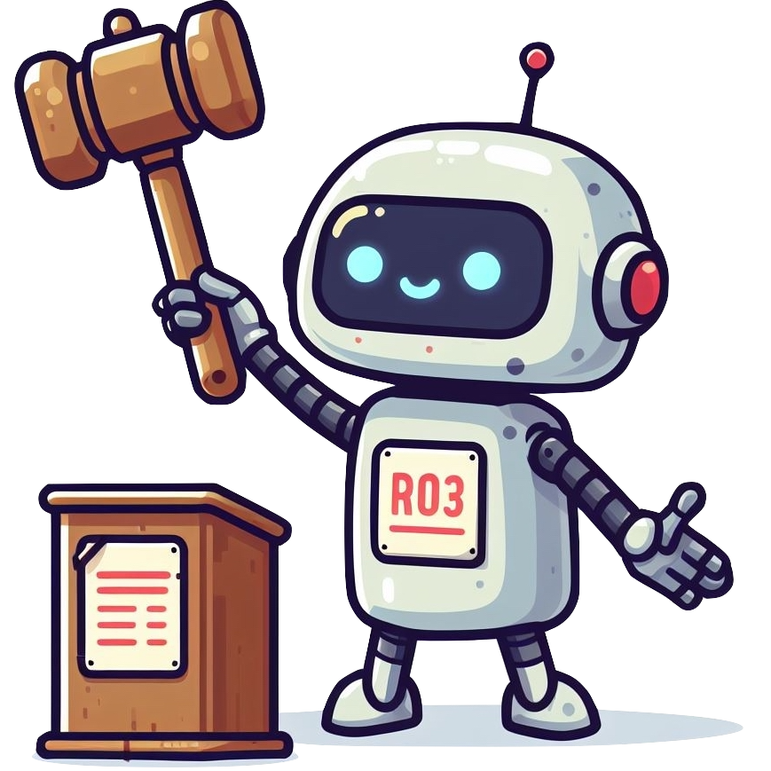
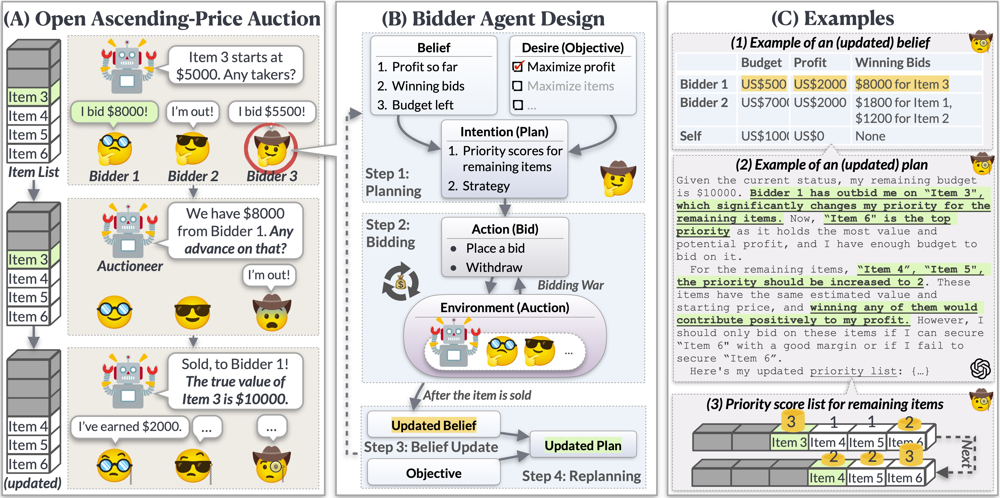

# Auction Arena

Source code for our paper: [Put Your Money Where Your Mouth Is: Evaluating Strategic Planning and Execution of LLM Agents in an Auction Arena](https://auction-arena.github.io). (Logo generated by [DALL·E 3](https://openai.com/dall-e-3).)

## What is Auction Arena?

Auction Arena is a simulated multi-agent battleground for Language Agents (or humans) to battle with each other for clear objectives, such as earn as much 💰 as possible (🤑🤑🤑). This is a setting chosen for being highly strategic, unpredictable and involving many skills related to resource and risk management, while also being easy to evaluate.

## DEMO System

The demo of this auction arena is hosted at [Auction-Arena-Demo](https://huggingface.co/spaces/jiangjiechen/Auction-Arena-Demo). Have fun with that! You can either watch a bunch of AI battling each other, or you can engage in the arena personally by setting `model_name` as `human`. Good luck with your score!

## Dependencies

- Prepare requirements: `pip install -r requirements.txt`
- Set OpenAI, Anthropic, Google API Key: 
  - `export OPENAI_API_KEY=xxx` (For GPT-4 or GPT-3.5)
  - `export ANTHROPIC_API_KEY=xxx` (For Claude-2 or Claude-Instant-1.2)
  - `export GOOGLE_API_KEY=xxx` (For PaLM-2, but you may have RateLimitError using GenerativeAI platform.)

## Set up Demo

Run `python3 app.py`.

## Run Experiments

Run `python3 auction_workflow.py --input_dir data/example --repeat 1 --shuffle --threads 2`

Note that there must be an `items_demo.jsonl` and a `bidders_demo.jsonl` file within `data/example` directory. You can set the parameters of bidders and items in these two files. 

## Citation

If you find our work useful for yours, please kindly cite our paper.
